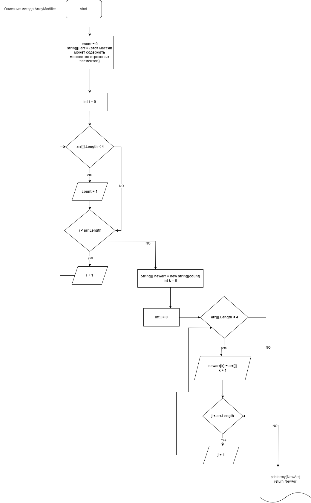

### Задача:
 Написать программу, которая из имеющегося массива строк формирует новый массив из строк,
длина которых меньше, либо равна 3 символам. Первоначальный массив можно ввести с клавиатуры, либо задать на старте выполнения алгоритма.

При решении не рекомендуется пользоваться коллекциями, лучше обойтись исключительно массивами.

### Решение

1. Код в основном состоит из методов, всего их 4  
(printarray, StringInput, ArrayModifier, CheckInt)

2. Первый метод "*pprintarray*" отвечает за вывод массива в терминал.

3. Второй метод "*StringInput*" дает возможность пользователю ввести элементы массива с клавиатуры. Сначала пользователю потребуется ввести количество элементов в массиве, а затем сами элементы по одному за раз.

4. Третий метод "*ArrayModifier*" принимает строчный массив который был создан при помощи метода №2 и в результате выдает новый массив строк включающий в себя элементы первого массива, НО удовлетворяющий условию задания (все элементы состоят из трех или меньше знаков).

5. Четвертый метод "*CheckInt*" проверяет ввел ли пользователь число или строчное выражение. Если пользователь ввел не число, то Метод попросит его повторить ввод.

Также присутствует блок-схема метода "arraymodifier":

*ссылка*
https://drive.google.com/file/d/127NExvEU97TYH39DYKZ6L2LUddTlvLDo/view?usp=drive_link

*png изображение*

